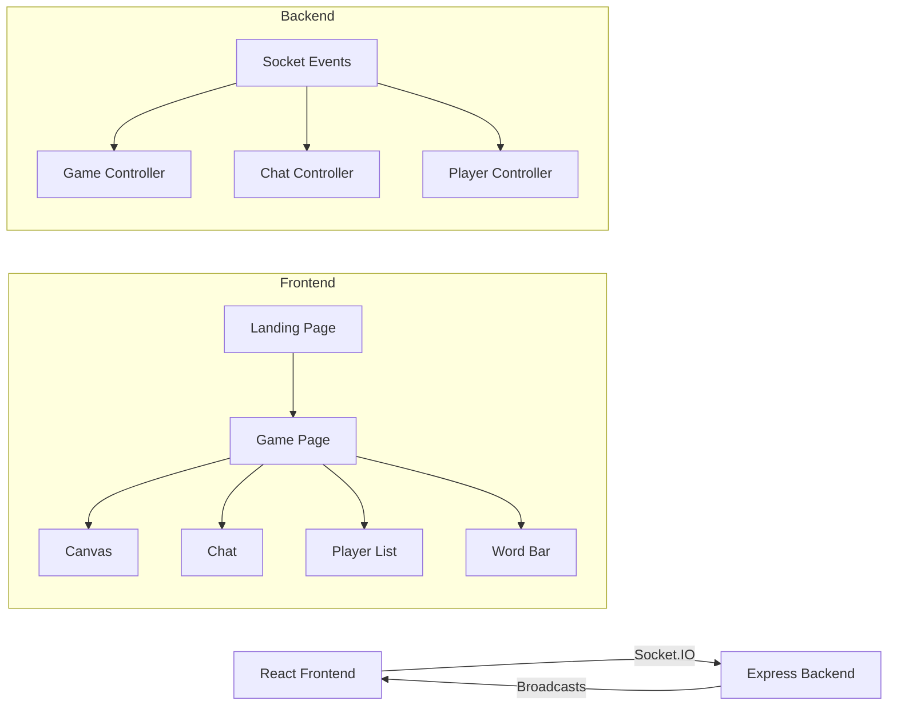

<p align="center">
  
</p>

<h1 align="center">🎨 Scribbly</h1>

<p align="center">
  <strong>A real-time multiplayer draw-and-guess game — like Pictionary, but in your browser!</strong>
</p>

<p align="center">
  
  
  
  
  
  
  
</p>

<p align="center">
  <a href="#-features">Features</a> •
  <a href="#-tech-stack">Tech Stack</a> •
  <a href="#-getting-started">Getting Started</a> •
  <a href="#-project-structure">Project Structure</a> •
  <a href="#-how-to-play">How to Play</a> •
  <a href="#-contributing">Contributing</a> •
  <a href="#-license">License</a>
</p>

---

## ✨ Features

| Feature                            | Description                                                                                                |
| ---------------------------------- | ---------------------------------------------------------------------------------------------------------- |
| 🖌️ **Real-Time Drawing Canvas**    | Draw with customizable brush sizes, 20+ colors, color picker, eraser, fill bucket, and instant clear       |
| 💬 **Live Chat & Guess Detection** | Chat in real-time — correct guesses are auto-detected and the word is hidden from guessers                 |
| 🔄 **Turn-Based Rounds**           | Players take turns drawing while others guess; the game supports multiple configurable rounds              |
| ⏱️ **Server-Authoritative Timer**  | 75-second turn timer synced from the server — no cheating the clock!                                       |
| 🏆 **Smart Scoring System**        | Time-based scoring rewards faster guessers; drawers earn bonus points per correct guess                    |
| 👤 **Avatar Selection**            | Choose from 15 unique avatars or hit "Random" for a surprise pick                                          |
| 👀 **Spectator Mode**              | Join mid-game without disrupting play — spectators see the live drawing and canvas state synced on arrival |
| 📊 **Game Over Leaderboard**       | Final rankings with scores displayed at the end of all rounds                                              |
| 🎯 **Word Selection**              | Drawers pick from a set of word options before each turn                                                   |
| ⚡ **Early Turn End**              | Turn ends immediately when all eligible players guess correctly                                            |
| 🔔 **Join / Leave Notifications**  | Chat shows system messages when players join or leave the match                                            |

---

## 🛠️ Tech Stack

### Frontend

- **React 19** — UI library with hooks-based architecture
- **TypeScript** — Type-safe development
- **Vite 7** — Lightning-fast dev server and build tool
- **Tailwind CSS 4** — Utility-first styling
- **Radix UI + shadcn/ui** — Accessible, polished UI components
- **Socket.IO Client** — Real-time WebSocket communication
- **React Router DOM** — Client-side routing
- **Lucide React** — Beautiful icon set

### Backend

- **Node.js + Express 5** — HTTP server
- **Socket.IO** — Real-time bidirectional event-based communication
- **CORS** — Cross-origin resource sharing
- **Nodemon** — Hot-reload during development

---

## 🚀 Getting Started

### Prerequisites

- **Node.js** ≥ 18
- **pnpm** (recommended) — or npm / yarn

### Installation

1. **Clone the repository**

   ```bash
   git clone https://github.com/your-username/scribbly.git
   cd scribbly
   ```

2. **Install backend dependencies**

   ```bash
   cd Backend
   pnpm install
   ```

3. **Install frontend dependencies**
   ```bash
   cd ../Frontend
   pnpm install
   ```

### Running the App

You need **two terminals** — one for each service:

**Terminal 1 — Start the Backend**

```bash
cd Backend
pnpm run dev
```

> Server runs on `http://localhost:3001`

**Terminal 2 — Start the Frontend**

```bash
cd Frontend
pnpm run dev
```

> App opens at `http://localhost:5173`

---

## 📁 Project Structure

```
scribbly/
├── Backend/
│   ├── config/
│   │   └── server.js          # Express + Socket.IO server setup
│   ├── controllers/
│   │   ├── chatController.js  # Chat & guess detection logic
│   │   ├── gameController.js  # Game lifecycle, turns, rounds, timer
│   │   └── playerController.js # Player state management
│   ├── routes/
│   │   └── index.js           # API routes
│   └── index.js               # Entry point & Socket.IO event handlers
│
├── Frontend/
│   ├── public/
│   │   └── avatars/           # 15 avatar images
│   └── src/
│       ├── components/
│       │   ├── Canvas.tsx          # Drawing canvas with tools
│       │   ├── ChatSidebar.tsx     # Chat panel
│       │   ├── PlayerListSidebar.tsx # Player list with scores
│       │   ├── Wordbar.tsx         # Word display + timer + round info
│       │   ├── WordSelectionOverlay.tsx # Word picker for drawers
│       │   ├── GameOver.tsx        # Game over leaderboard
│       │   ├── AvatarSelector.tsx  # Avatar selection grid
│       │   ├── Background.tsx      # Animated background
│       │   ├── WaitingBanner.tsx   # Spectator waiting message
│       │   └── ui/                 # shadcn/ui primitives
│       ├── hooks/
│       │   ├── useGameSocket.ts    # All game socket event logic
│       │   └── useCanvas.ts       # Canvas drawing engine
│       ├── pages/
│       │   ├── landing.tsx        # Home / lobby page
│       │   └── game.tsx           # Main game page
│       ├── App.tsx                # Router setup
│       └── types.ts               # Shared TypeScript interfaces
│
└── README.md
```

---

## 🎮 How to Play

1. **Enter your name** and **select an avatar** on the landing page
2. **Click "Quick Play"** to join the game lobby
3. The game **starts automatically** when **2 players** are connected
4. Each round, one player **draws** while others **guess** in the chat
5. The drawer **picks a word** from 3 options, then has **75 seconds** to draw it
6. **Type your guess** in the chat — correct guesses are detected automatically!
7. **Faster guesses = more points** — the scorer rewards quick thinking
8. After all rounds, the **leaderboard** reveals the winner 🏆

> 💡 **Joining mid-game?** No worries — you'll enter as a spectator and see the live drawing until the next turn.

---

## 🏗️ Architecture Overview



---

## 🤝 Contributing

Contributions are welcome! Here's how you can help:

1. **Fork** the repository
2. **Create** a feature branch (`git checkout -b feature/amazing-feature`)
3. **Commit** your changes (`git commit -m 'Add amazing feature'`)
4. **Push** to the branch (`git push origin feature/amazing-feature`)
5. **Open** a Pull Request

---

## 📄 License

This project is licensed under the [ISC License](https://opensource.org/licenses/ISC).

---

<p align="center">
  Made with ❤️ and 🎨 by <strong>Scribbly Team</strong>
</p>
